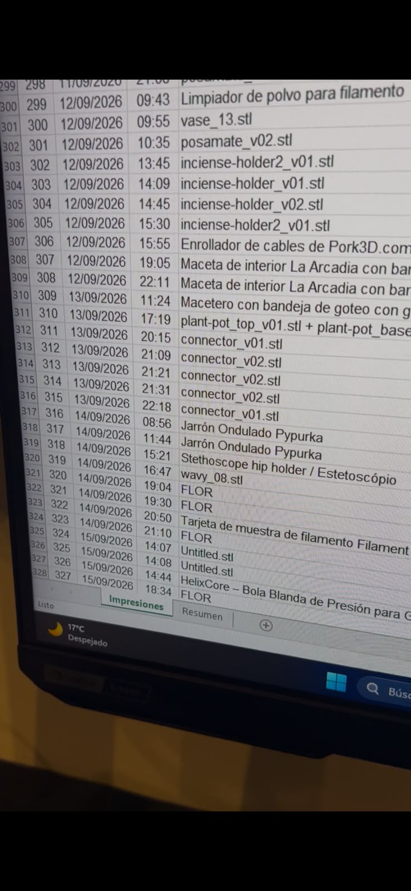

# bambu-to-excel-auto-sync

Background service that listens to a Bambu Lab printer's local MQTT (LAN
mode) and, every time a print finishes, is cancelled, or fails, automatically
adds a row to an Excel history file. No cloud, no Bambu account required.
It runs locally on your PC, requiring no manual intervention.
Upon completion of a 3D print, the print job is automatically added as a new row in Excel.

Servicio en segundo plano que escucha el MQTT local (modo LAN) de una
impresora Bambu Lab y agrega automáticamente una fila a un Excel de
historial cada vez que una impresión termina, se cancela o falla. No
depende de la nube ni de tu cuenta de Bambu.
Corre en tu pc de forma local, sin que toques nada.
Automáticamente al finalizar una impresión 3D, se agrega esa impresión a una nueva fila en excel.

## Choose your language / Elegí tu idioma

- 🇬🇧 [English version](en/) — see [en/README.txt](en/README.txt)
- 🇪🇸 [Versión en español](es/) — ver [es/LEEME.txt](es/LEEME.txt)

Both folders contain the same tool (identical logic, translated
strings/labels): a Windows one-click installer, an MQTT client, and an
Excel-writing library.

## Screenshots / Capturas

  
  

Demo videos:

Finished print, auto-synced to Excel:

https://github.com/user-attachments/assets/ee432ea6-313f-41e5-bfe2-75f2ac2bcbff

45 days / 327 prints of accumulated history:

https://github.com/user-attachments/assets/52cc78d5-62bc-4916-8d9e-e15f4066f616

## Requirements

- Windows + Python 3 (installer handles the pip dependencies)
- A Bambu Lab printer with LAN Mode enabled (default on most A1 / A1 mini / P1P)

## Security note

`config.json` in each folder ships with placeholder values
(`CHANGE_IP` / `CAMBIAR_IP`, etc.) — fill in your own printer's IP,
LAN access code, and serial number after downloading. Never commit your
filled-in `config.json` to a public repo; it contains your printer's LAN
access code.

## License

MIT — see [LICENSE](LICENSE).
